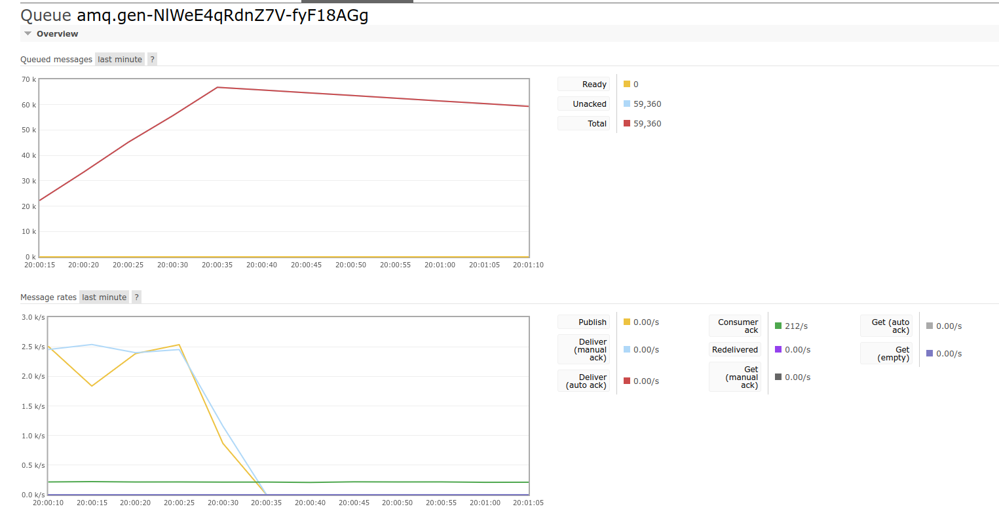
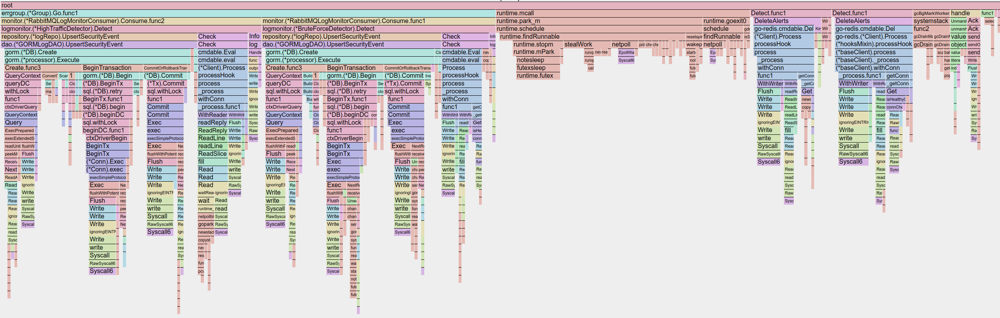

# A REST API + RabbitMQ demo project

<!--toc:start-->
- [A REST API + RabbitMQ demo project](#a-rest-api-rabbitmq-demo-project)
  - [Test setup](#test-setup)
  - [Tests Result](#tests-result)
  - [Reflections](#reflections)
    - [Things done](#things-done)
    - [Things that can be evidently improved](#things-that-can-be-evidently-improved)
  - [Subject generated by ChatGPT](#subject-generated-by-chatgpt)
    - [**Comprehensive Scenario: Implementing a Security Event Monitoring and Processing System**](#comprehensive-scenario-implementing-a-security-event-monitoring-and-processing-system)
    - [**Problem Requirements:**](#problem-requirements)
    - [**Additional Requirements:**](#additional-requirements)
    - [**Example Scoring Criteria:**](#example-scoring-criteria)
    - [**Sample Outputs**](#sample-outputs)
    - [**Study Tips:**](#study-tips)
<!--toc:end-->

This is a demo project of security event monitoring.

Technical stack:

- `Gin` as web framework
- `Gorm` as ORM framework
- `Postgres` as Database
- `Redis` for rate limiting and cache
- `RabbitMQ` for asynchronous processing
- `Docker` for environment setup
- `wrk` for stress tests

Key functions:

- `POST /logs` API that accepts the following type of input, and pushed for security issues checking:

     ```json
     {
       "timestamp": "2025-01-08T12:00:00Z",
       "client_ip": "192.168.1.1",
       "endpoint": "/api/v1/resource",
       "method": "GET",
       "status_code": 401
     }
     ```

- `GET /alerts` API that can return recent security issues (`type` and `limit` are accepted as query parameters)

- Brute force event (5 401 in 1 minute from the same IP) and High traffic event (10 access in 1 minute from the same IP) are implemented as checker.

## Test setup

```sh
docker compose up -d # start docker

# create rabbitmq user and password
docker exec -it secumon-rabbitmq-1 rabbitmqctl add_user "secumon" "secumon"
docker exec -it secumon-rabbitmq-1 rabbitmqctl set_user_tags secumon administrator
docker exec -it secumon-rabbitmq-1 rabbitmqctl set_permissions -p / secumon ".*" ".*" ".*"

# run the backend
go run ./...

# Test with Postman, curl or other tools
```

## Tests Result



Publish rate: 2500/s
Consume rate: 200/s

Tested with `wrk` :

```sh

$ wrk -t2 -d30s -c10 -s ./scripts/wrk/publish.lua http://localhost:8989/logs
Running 30s test @ http://localhost:8989/logs
  2 threads and 10 connections
  Thread Stats   Avg      Stdev     Max   +/- Stdev
    Latency     5.02ms    1.87ms  21.28ms   72.16%
    Req/Sec     1.01k   262.57     1.75k    69.00%
  60144 requests in 30.02s, 10.27MB read
Requests/sec:   2003.64
Transfer/sec:    350.25KB
```

Query `/alerts` :

```sh
$ wrk -t2 -d30s -c10 -s ./scripts/wrk/alert.lua http://localhost:8989/alerts
Running 30s test @ http://localhost:8989/alerts
  2 threads and 10 connections
  Thread Stats   Avg      Stdev     Max   +/- Stdev
    Latency     1.46ms    2.80ms  39.28ms   94.72%
    Req/Sec     5.58k     1.98k    9.41k    62.50%
  333203 requests in 30.01s, 472.20MB read
Requests/sec:  11102.83
Transfer/sec:     15.73MB
```

With `pprof`, we can see that the bottleneck of the consumer is the DB access:



## Reflections

### Things done

In almost a weekend, I have globally implemeted what is asked in the requirements.

- I used Test-Driven method to implement the `/logs` API.
- Code respects the DDD clean architecture with webAPI level, service level, repository level and data access object level (DAO), along with domain objects and events defined in separated directories for the readability.
- I used `RabbitMQ` as the middleware to asynchronously handle log monitor service
  - One publisher and one consumer sharing the same connection and using a `direct` exchange --> The simplest way to get everything started. Many things could be improved (see the next section)
- I used `Redis` to handle the rate-limit detection feature. Both Brute force and Abnormal Traffic share the same logic: rate limit. So I wrote a rate-limiter with a `redis lua script`. And the code is written with Decorator Pattern for reusability.
- I also used `Redis` as cache for the `/alerts` query requests, the cache is set when first query, and deleted when new data is inserted to guarantee the consistency.
- The security events are stored into `PostgreSQL`. Indexes are set wisely for a better performance.
- API Stress tests with `wrk`
- Performance analysis with `pprof`

### Things that can be evidently improved

- A configuration module for the setup
- Unit tests for checker logics and alert API
- Integration tests for the whole system
- API Documentation
- Authentication for the APIs. It could be done using a JWT Token.
- Mechanisms to protect my own APIs. I could obviously add a rate limiter middleware in case of an attack.
- Based on the business requirements, we can decide if the deliveries have to be acked. But it was not ack the bottleneck of the system after all.
- Whether or not use an ORM framework for the sake of performance because this is a rather simple service that can be coded with `sqlc`
- Split publisher and consumer into 2 distinct services in a microservice architecture.
- Create a dockerfile and run everything in the same docker image. Or even the deployment on Kubernetes.
- And many other things I didn't think of ...

---

## Subject generated by ChatGPT

### **Comprehensive Scenario: Implementing a Security Event Monitoring and Processing System**

**Background:**
You are tasked with developing a system for a company to monitor API access logs from client systems and detect potential security incidents (e.g., frequent 401 Unauthorized errors). The system should leverage REST API and RabbitMQ for data transmission and processing.

---

### **Problem Requirements:**

1. **Data Collection and Log Simulation**
   - Develop a REST API to receive access logs from client systems. Each log entry contains the following fields:
     ```json
     {
       "timestamp": "2025-01-08T12:00:00Z",
       "client_ip": "192.168.1.1",
       "endpoint": "/api/v1/resource",
       "method": "GET",
       "status_code": 401
     }
     ```
   - Logs are submitted via a `POST /logs` endpoint. The server should validate the log data's format. Invalid logs should return a 400 status code.

2. **Log Processing and Message Queue**
   - Each received log entry should be asynchronously sent to a RabbitMQ queue. Requirements:
     - Queue name: `api-security-logs`.
     - Use a `routing key` to categorize logs (e.g., by `status_code`).

3. **Security Event Detection Service**
   - Implement a consumer service to process messages from the `api-security-logs` queue and identify potential security incidents:
     - **Brute Force Attack**: The same `client_ip` sends 5 consecutive 401 errors within 1 minute.
     - **Abnormal Traffic**: A single `client_ip` makes over 100 requests within 1 minute.
   - If a security incident is detected, log an alert message (e.g., "Potential brute force attack detected, IP: 192.168.1.1").

4. **Extended Features (Optional)**
   - Add a REST API to query detected security events, such as:
     - `GET /alerts`: Returns the 10 most recent security events.
     - `GET /alerts?type=bruteforce`: Filters events by type (e.g., brute force attacks).
   - Store detected security events in memory for query purposes.

---

### **Additional Requirements:**
- **Security**:
  - Validate that the `POST /logs` request contains a valid API key (simulate API authentication).
  - Ensure RabbitMQ uses secure connection settings, such as username and password.
- **High Concurrency**:
  - The log-receiving API should handle 1000 logs per second. You may use techniques such as goroutine pools or queue length limitations.

---

### **Example Scoring Criteria:**
1. **Functionality:**
   - Whether the core functionalities of log reception, queue transmission, and event detection are implemented.
2. **Code Quality:**
   - Whether the code is modular, well-structured, and leverages appropriate Go features (e.g., `goroutines`, `channels`).
3. **Security Design:**
   - Whether the solution effectively simulates API authentication.
   - Whether it addresses queue reliability and exception handling.
4. **Extensibility:**
   - Whether the system can easily incorporate new detection logic for additional security incidents.
5. **Performance Optimization:**
   - Whether the system considers handling high-concurrency scenarios efficiently.

---

### **Sample Outputs**
- Log Reception API Response:
  ```json
  {
    "status": "success",
    "message": "Log received and queued."
  }
  ```

- Alerts from Detection Service:
  ```
  [ALERT] Brute force attack detected from IP: 192.168.1.1
  [ALERT] High traffic detected from IP: 10.0.0.5
  ```

- Security Event Query API Response:
  ```json
  [
    {
      "type": "bruteforce",
      "timestamp": "2025-01-08T12:05:00Z",
      "client_ip": "192.168.1.1",
      "details": "5 consecutive 401 errors within 1 minute"
    }
  ]
  ```

---

### **Study Tips:**
- **REST API:**
  - Learn to validate incoming JSON data (e.g., schema validation).
  - Understand how to implement pagination and filtering in APIs.
- **RabbitMQ:**
  - Familiarize yourself with queue setup, exchanges, and `routing keys`.
  - Study consumer `ack` mechanisms and retry logic.
  - Implement time-window statistics (e.g., IP request frequency) using `sync.Map` or `time.Timer`.

---

This comprehensive scenario is closely related to the business of API security testing. It covers realistic use cases and evaluates your ability to integrate REST APIs, RabbitMQ, and Go effectively.
